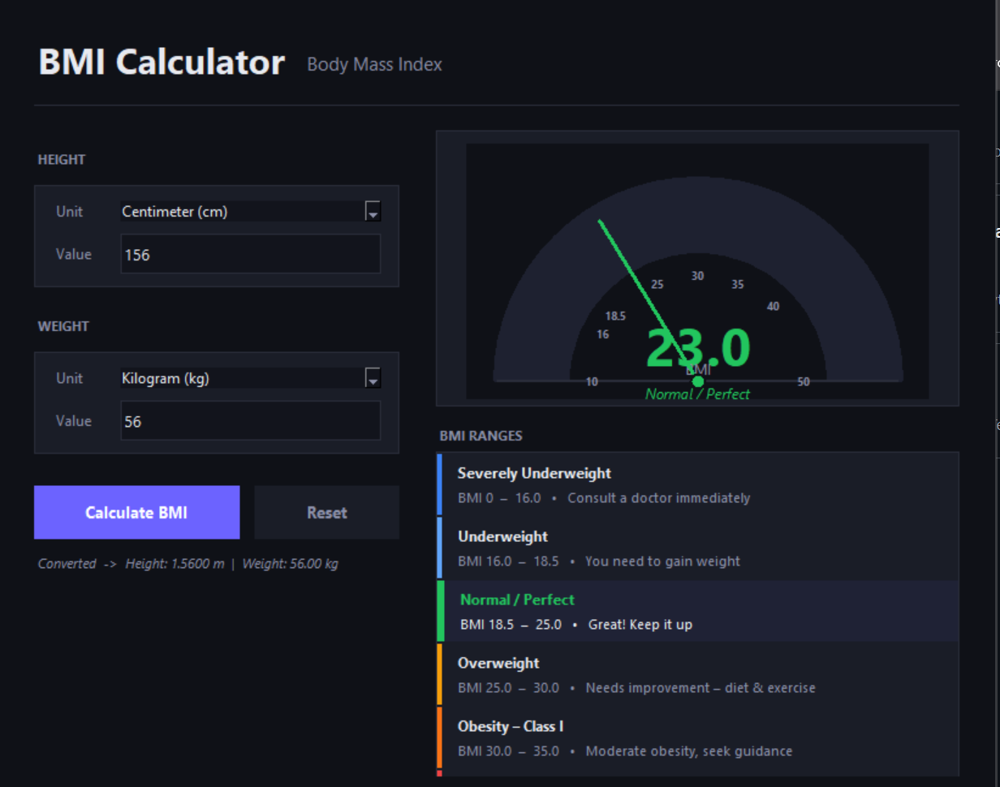

# BMI Calculator

A minimal, dark-themed **Body Mass Index Calculator** built with Python and Tkinter — no third-party dependencies required.




---

## Features

- **Multi-unit height input** — Meter, Centimeter, Millimeter, Feet, Inches
- **Multi-unit weight input** — Kilogram, Pound (lbs), Gram
- **Auto unit conversion** — All values internally converted to SI units (meters / kg)
- **Animated semi-circle gauge** — Colour-coded needle sweeps to your BMI result
- **BMI range reference table** — Active category highlights in real time
- **Input validation** — Friendly error displays for invalid, negative (`-20`), zero (`0`), or empty values
- **Universal Keyboard Shortcut** — Pressing `Enter` / `Return` triggers calculation from anywhere
- **Copy Result** — Click to copy BMI and category formatting directly to clipboard
- **Personalized Health Tips** — Shows dynamic health advice list (`✔`) corresponding to your range
- **Calculation History (JSON)** — Automatically logs past calculations in `bmi_history.json` and loads them in the history tab
- **Export PDF report** — Generate structured PDF health reports containing patient name, values, classification, and wellness tips
- **Responsive Layout** — Supports window resizing and scales dynamically down to `820x720` minimum size
- **Reset button** — Clears all inputs, gauge pointer, and active highlights

---

## BMI Categories

| BMI Range | Category | Advice |
|-----------|----------|--------|
| < 16 | Severely Underweight | Consult a doctor immediately |
| 16 – 18.5 | Underweight | You need to gain weight |
| 18.5 – 25 | Normal / Perfect | Great! Keep it up |
| 25 – 30 | Overweight | Needs improvement – diet & exercise |
| 30 – 35 | Obesity – Class I | Moderate obesity, seek guidance |
| 35 – 40 | Obesity – Class II | Severe obesity, consult a specialist |
| 40 + | Obesity – Class III | Morbid obesity, medical care needed |

---

## Requirements

- Python **3.8** or higher
- `tkinter` (included with standard Python on Windows; see below for Linux/macOS)
- `reportlab` (required for PDF report exports)

### Installation of reportlab
To install the PDF export package, run:
```bash
pip install reportlab
```

### Linux (if tkinter is missing)
```bash
sudo apt-get install python3-tk        # Debian / Ubuntu
sudo dnf install python3-tkinter       # Fedora
```

### macOS
```bash
brew install python-tk                 # via Homebrew
```

---

## Installation & Running

```bash
# 1. Clone the repository
git clone https://github.com/your-username/bmi-calculator.git
cd bmi-calculator

# 2. Run the app (no pip install needed)
python bmi_calculator.py
```

---

## Project Structure

```
BMI Calculator/
├── bmi_calculator.py   # Main application (single file)
├── bmi_history.json    # History log database (auto-generated)
├── README.md           # Project documentation
├── .gitignore          # Git ignore rules
└── Preview.png         # Project GUI screenshot
```

---

## How to Use

1. **Select a height unit** from the dropdown (e.g. Centimeter).
2. **Enter your height value** in the input field (e.g. `170`).
3. **Select a weight unit** from the dropdown (e.g. Kilogram).
4. **Enter your weight value** in the input field (e.g. `65`).
5. Press **Calculate BMI**, or press the **Enter / Return** key on your keyboard.
6. The needle animates to your result on the gauge, and your active range is highlighted.
7. Under the actions panel, you will see a detailed list of **Health Recommendations** customized to your result.
8. Use **Copy Result** to copy the formatted text to your clipboard, or **Export PDF** to create a complete PDF assessment report.
9. Switch to the **Calculation History** tab to view your past logs, or clear them.

---

## BMI Formula

```
BMI = weight (kg) / height² (m²)
```

> **Disclaimer:** BMI is a general screening tool and is not a diagnostic measure.
> Consult a qualified healthcare professional for personalised health advice.

---

## License

This project is licensed under the [MIT License](LICENSE).
